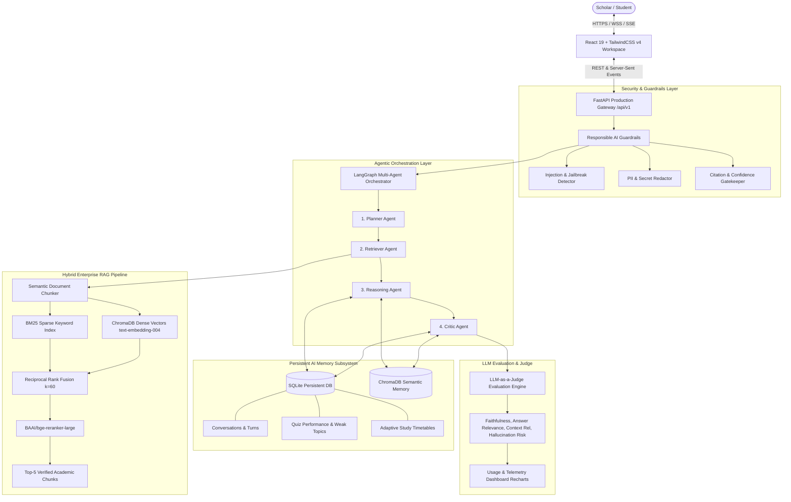
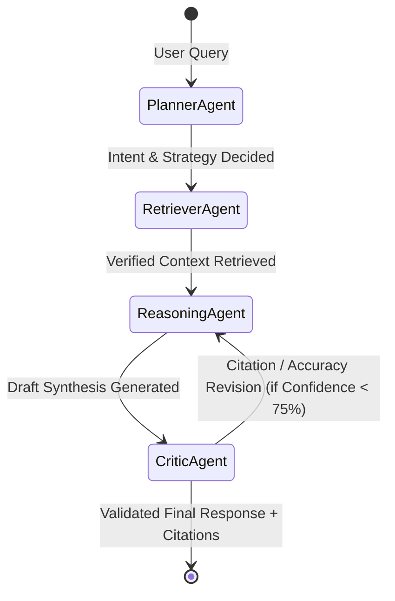

# Learn-Lynx v2 — Enterprise Architecture & System Blueprint

## Executive Overview
**Learn-Lynx** is an enterprise-grade **Agentic AI Learning Assistant** that transforms static academic textbooks and lecture notes into interactive, cited study workspaces, adaptive quiz arenas, and intelligent study plans.

Built on **FastAPI (Python)**, **LangGraph + LangChain**, **Hybrid RAG (ChromaDB + BM25 + BGE Reranker)**, **SQLite Persistent Memory**, and a **React 19 + TailwindCSS v4** frontend.

---

## 1. High-Level System Architecture

---

## 2. Core Subsystems

### A. Hybrid Enterprise RAG Pipeline
1. **Semantic Document Parsing (`pdfplumber`)**:
   - Ingests university lecture notes, extracts structural hierarchies (Chapter, Page, Topic, Section, Chunk ID).
2. **Dense Vector Embeddings (`text-embedding-004`)**:
   - Computes 768-dimensional normalized dense vector representations stored in ChromaDB.
3. **Sparse BM25 Keyword Search (`rank-bm25`)**:
   - Inverted index for exact acronyms, theorem names, and code identifiers.
4. **Reciprocal Rank Fusion (RRF)**:
   $$RRF\_Score(d) = \sum_{m \in \{Dense, Sparse\}} \frac{1}{k + rank_m(d)} \quad (k = 60)$$
5. **Cross-Encoder Re-Ranking (`BAAI/bge-reranker-large`)**:
   - Deep cross-attention score over top-20 fused candidates to extract the Top-5 most relevant passages.

---

### B. LangGraph 4-Agent Orchestration Layer

1. **Planner Agent**: Classifies student intent (`explain_topic`, `summarize`, `quiz`, `study_plan`, `search_notes`, `web_search`).
2. **Retriever Agent**: Dynamically selects between Local Dense RAG, Hybrid RAG, or Grounded Web Search.
3. **Reasoning Agent**: Synthesizes formal proofs, code blocks, and socratic step-by-step explanations using LangChain tools.
4. **Critic Agent**: Validates claims against citations, calculates confidence score (0–100%), and evaluates hallucination risk.

---

### C. Persistent Memory Subsystem
- **SQLite Database**:
  - `conversations` & `conversation_messages`: Multi-turn chat persistence with titles and summaries.
  - `quiz_history`: Score tracking, weak topic tagging, and question breakdown.
  - `study_preferences`: Target exam dates, preferred study hours, and mastery tags.
- **ChromaDB Semantic Memory**: Embeds past conversations to recall contextual background across study sessions.

---

### D. Responsible AI Guardrails Layer
- **Prompt Injection Defense**: High-precision regex pattern matchers blocking system instruction overrides.
- **Jailbreak Shield**: Blocks DAN (Do Anything Now) and unfiltered rogue persona exploits.
- **PII & Secret Key Redactor**: Auto-detects and redacts SSNs, credit cards, emails, phone numbers, and API keys.
- **Factual Citation Gate**: Enforces mandatory verified textbook citations on academic claims.

---

### E. LLM Evaluation Suite & Judge
- Evaluates responses across 8 standard metrics:
  - Context Relevance
  - Answer Relevance
  - Faithfulness
  - Hallucination Risk
  - Retrieval Score
  - Latency (ms)
  - Token Usage
  - Critic Confidence
- Side-by-Side comparator against Vanilla Dense Vector baselines.
